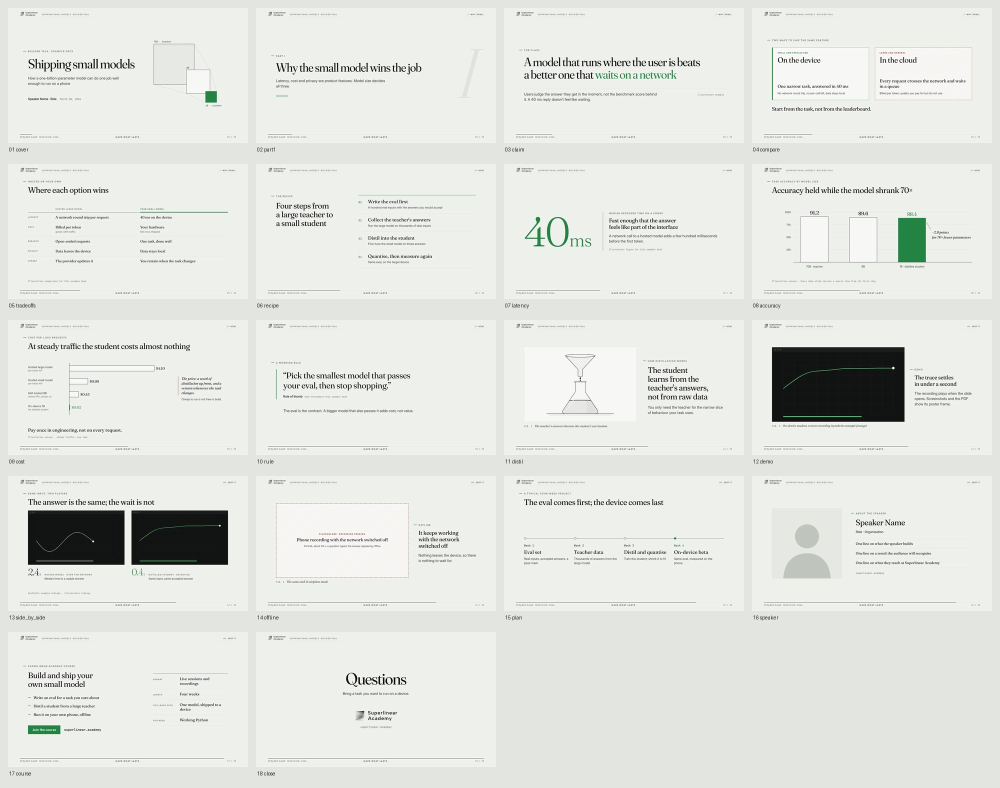
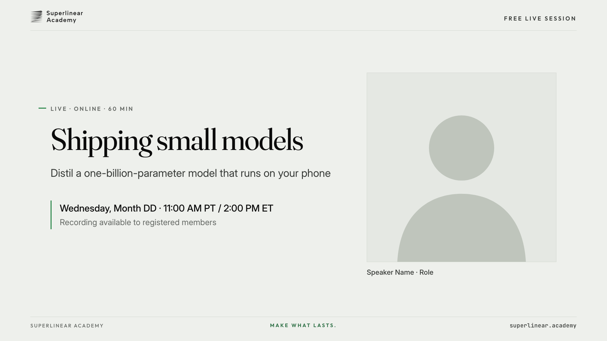
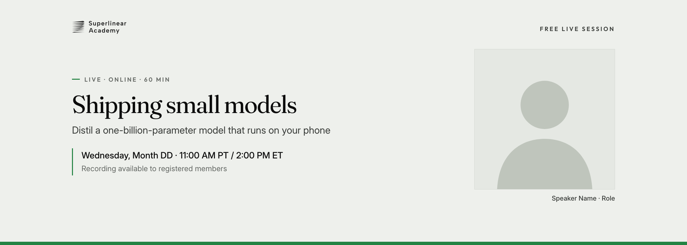

# Superlinear Academy brand skill

An agent skill that lets any AI coding agent produce on-brand Superlinear Academy visuals: slide decks, promo
images, event covers and link-preview cards. It packages the brand's design tokens, vendored fonts, official logo
files, a slide theme, a library of 13 slide layouts, three promo templates, and a script that renders HTML to PNG
and audits the result.

The look is a "monochrome editorial" register: pale sage paper, near-black ink, the brand green `#238343` as the
only bright colour, a restrained oxblood second colour, Fraunces serif display type with Outfit labels, hairline
structure, no shadows.

| Slides (canvas deck) | 16:9 promo | Event cover 2.8:1 |
|---|---|---|
|  |  |  |

## What is inside

```
skills/superlinear-brand/      the skill (install this folder)
  SKILL.md                     root skill: workflow, hard rules, index of references
  references/                  tokens & type, logo usage, slide theme, layouts, promo formats, pitfalls, verification
  theme/                       tokens.css, layouts.css, canvas.css, promo.css, fonts/, logos/, placeholders/
  templates/                   promo_16x9.html, event_cover_2_8.html, og_1200x630.html
  scripts/render.py            HTML -> PNG with an offline / overflow / wrap / safe-area audit
examples/
  shipping_small_models/       13-slide presentation-skill canvas deck, one slide per layout, screenshots
  promo/                       rendered templates + a Chinese 16:9 example
docs/                          prd.md, rfc.md, working.md
```

## Install as a skill

Give your agent this repository and ask it to install the skill:

```text
Install the skill in this repository into my workspace. Copy or link skills/superlinear-brand/ into my skills
directory (for Claude Code: ~/.claude/skills/superlinear-brand/ or .claude/skills/superlinear-brand/ in a project),
or register skills/superlinear-brand/SKILL.md in my workspace's skill index. Expose exactly one root skill.
```

The skill is self-contained: the theme, fonts, logos, templates and script all live under
`skills/superlinear-brand/`. For slides it composes with the presentation skill (`presentation_skill` package):
that skill provides the HTML canvas deck engine and workflow, this one provides the visual layer.

## Quick start

```bash
uv venv .venv
uv pip install --python .venv/bin/python -r requirements.txt
.venv/bin/python -m playwright install chromium        # or rely on an installed Google Chrome

# render the promo templates
.venv/bin/python skills/superlinear-brand/scripts/render.py page \
  skills/superlinear-brand/templates/*.html --out-dir out/

# render every slide of the example deck + contact sheet
.venv/bin/python skills/superlinear-brand/scripts/render.py deck examples/shipping_small_models
```

The script exits non-zero if a page makes an external request, logs a console error, fails to load a font or image,
lets text leave the canvas or the safe area, wraps a title past its `data-max-lines`, or crops a headshot.

To use the theme in a new deck, scaffold an HTML canvas deck with the presentation skill, copy
`skills/superlinear-brand/theme/` into it as `brand/`, and follow
[references/slide_theme.md](skills/superlinear-brand/references/slide_theme.md).

## Licence

Code and documentation: MIT ([LICENSE](LICENSE)). The Superlinear Academy logos and marks are trademarks provided for
on-brand use only and are not MIT-licensed ([TRADEMARKS.md](skills/superlinear-brand/theme/logos/TRADEMARKS.md)).
Bundled fonts keep their SIL Open Font License ([OFL.txt](skills/superlinear-brand/theme/fonts/OFL.txt)). The
example deck vendors Reveal.js (MIT).
